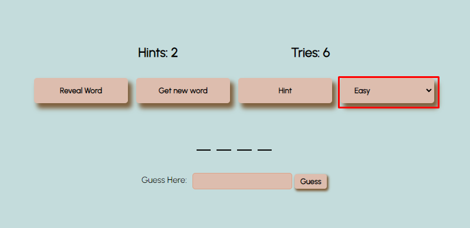
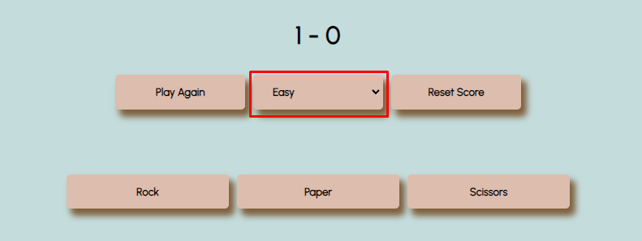

# Games

Created using Flask and VanillaJS. Includes Tic-Tac-Toe, Hangman, Rock Paper Scissors, and two types of guessing games. In one, you guess a randomly-generated number by the computer while in the other, the computer guesses your number using a binary search algorithm!

## Installation

Use the package manager [pip](https://pip.pypa.io/en/stable/) to install the following dependencies

- flask

Additionally, create a .env file in the root directory with the following variables
- DOMAIN
    - your local IP address.
- PORT
    - the port you want to use.
    
Then, change your directory to the `/games/src` directory. To start, type

```bash
python app.py
```
And you're finished!

## How to play

Click on any of the 5 modes.

1. Tic Tac Toe

    First player is "X" and click on any square. Next player is "O" and click on any square that is not occupied. The game will automatically switch between the players. To restart the game, click the `Restart` button. To reset the saved score at the top, click the `Reset Score` button.

2. Hangman

    There are different difficulties you can play on. To switch the difficulty, click the dropdown on the very right of the nav.
    

    If you have given up, click the `Reveal Word` button.
    
    If you want a new word, click the `Get new word` button.

    If you need a hint, click the `Hint` button. You don't have infinite hints! (# of hints are at the top)

    The number of tries you have is at the top. Good Luck!

3. Rock Paper Scissors

    In this game, you are playing against the computer so, yes, it is based on probability!

    To choose your option, click any of the three `Rock`, `Paper`, or `Scissors` buttons.

    To play again, click the `Play Again` button.

    To reset the saved score at the top, click the `Reset Score` button.

    To change difficulty, click the dropdown in the nav.
    

4. Guessing Games

    1. You Guess

        Enter the range you want the number to be in between and start guessing numbers in the bottom textbox.

        To reveal the number, click the `Reveal number` button

        To restart, click the `Restart` button.

    2. The Computer Guesses

        Enter the range you will choose a number between and enter your number.

        To restart, click the `Restart` button.

        When you press play, the computer will use a binary search algorithm to find your number!

    For both games you can see what guesses either you have made or the computer has made.
